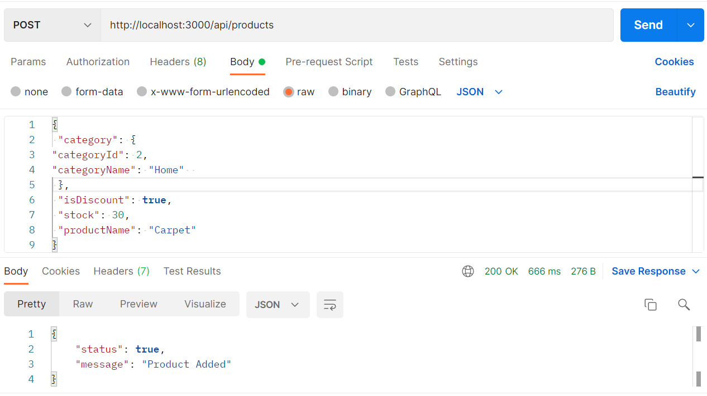
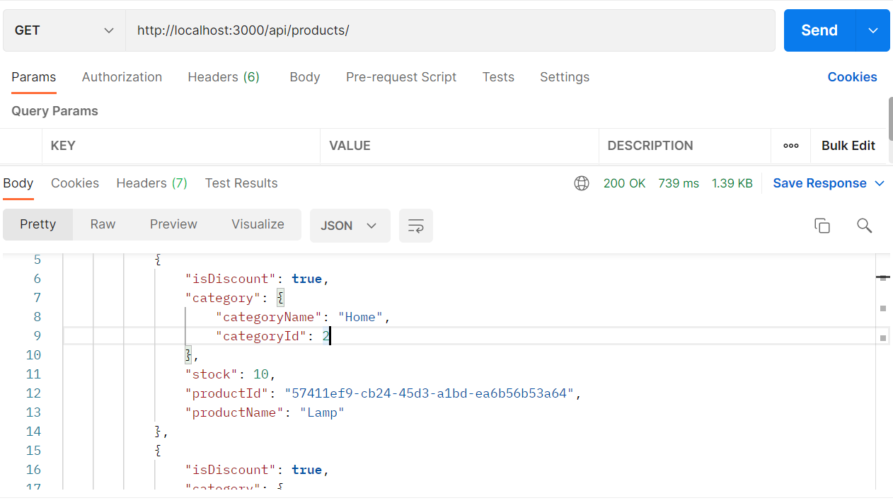
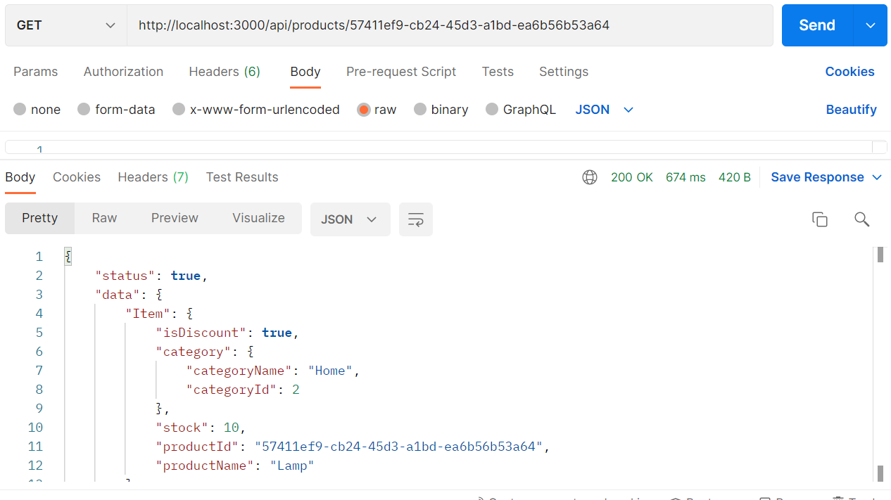
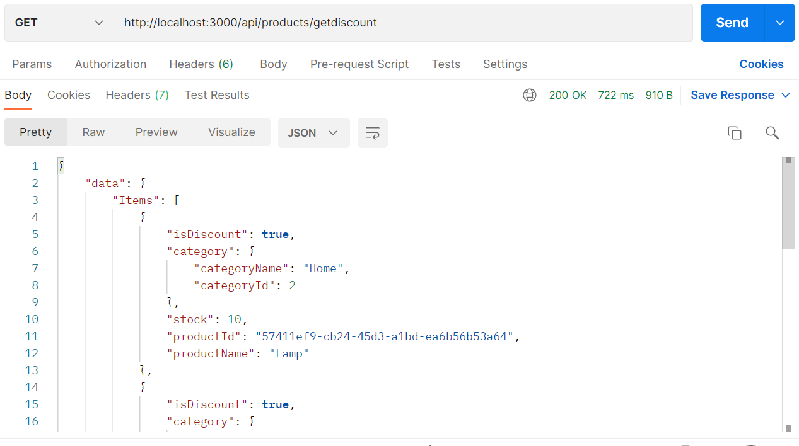
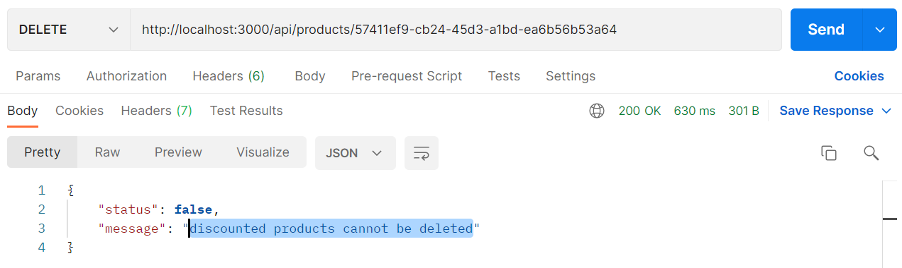
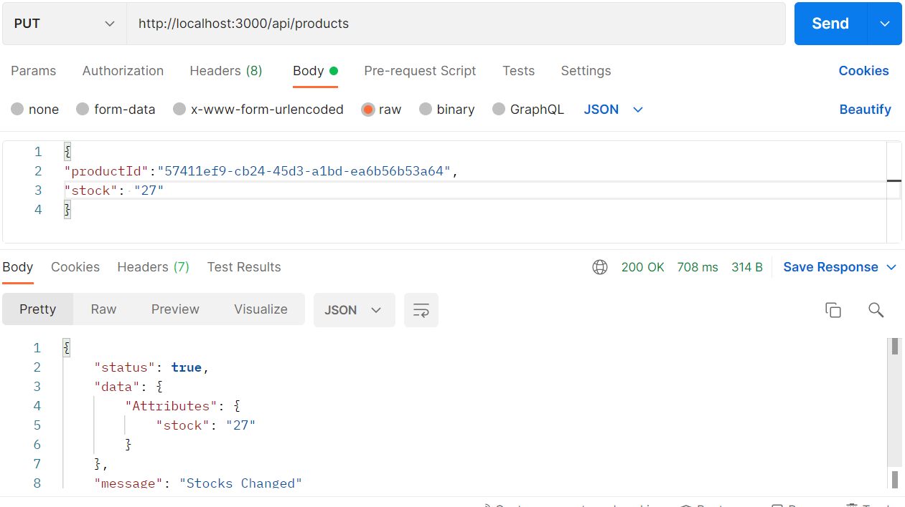

# A101 Bootcamp Homework 3

This repo is created for the third homework of the [A101 Node.js & TypeScript Amazon Lambda & DynamoDB](https://www.patika.dev/bootcamp/a101-amazon-lambda-dynamodb-bootcamp-node-js-typescript-programi) bootcamp.
The homework consists of 2 parts. The A part: CRUD Operations on DynamoDB. You can find this part below. The B part is differences between NoSQL and SQL. You can find this part in the [noSQLvsSQL.md](https://github.com/A101-Node-js-TypeScript-Bootcamp/a101-bootcamp-odev3-ustunmelih/blob/main/noSQLvsSQL.md) file.

## Part A instructions

- Product Table Design

```
{
productId: string’,
stock: number,
productName: string,
isDiscount: boolean,
category: {
categoryId: number,
categoryName: string}
}

```

- Product table POST endpoint
- Product table GET endpoint
- GET endpoint that will filter with query params according to productId
- GET endpoint to filter by products with discount
- DELETE endpoint that will delete any product with its productId (any product has discount should not be deleted, an error should be returned)
- UPDATE service that will change the stock of any product

## Installation

Run:

```bash
npm install
```

## Deployment

Run:

```
npx nodemon index.js
```

or

```
node index.js
```

or

```
nodemon index.js
```

## Technologies Used

- Node.js
- Express
- aws-sdk
- uuid

## Previews

- Product table POST endpoint

Returned `Product Added` success message and added it to our products table in DynamoDB.



- Product table GET endpoint

Shows all of our products found in the products table in DynamoDB



- GET endpoint that will filter with query params according to productId

Filtered and showed a product by its 'productId' in the products table in DynamoDB.



- GET endpoint to filter by products with discount

Listed only discounted products among the products in the products table in DynamoDB



- DELETE endpoint that will delete any product with its productId (any product has discount should not be deleted, an error should be returned)

Among the products in the products table in DynamoDB, only the product with the specified productId has been deleted.But when I tried to delete the discount product, the error message `discount products cannot be deleted` came up.



- UPDATE service that will change the stock of any product

We filter the product that we want to change the stock number among the products in the products table in DynamoDB with the productId and change the stock number.



## Licence

[MIT.](license)
