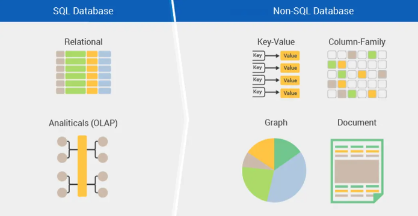

# SQL ve NoSQL Arasındaki Farklar

## İçindekiler

1. [SQL nedir?](#SQL-nedir)
2. [NoSQL nedir?](#NoSQL-nedir)
3. [SQL vs NoSQL](#typescript-vs-javascript)
4. [Kaynaklar](#kaynaklar)

## SQL Nedir?

SQL yani "Structured Query Language” , ilişkisel veri tabanı yönetim sistem için en yaygın ve popüler sorgu dilidir.En temelde yapılandırılmış verilerin CRUD diye tabir ettiğimiz ekleme, bulma, kaydetme, güncelleme, silme ve yeni tablolar oluşturma işlemlerini yaparak verileri yönetmeyi sağlayan sorgu dilidir.ilk olarak 1970'lerde IBM araştırmacısı Edgar Frank Codd tarafından yayınlanan “Büyük Paylaşılan Veri Bankaları için İlişkisel Veri Modeli” adlı bir makalede bahsedilen SQL temel amaç olarak ilişkisel veri tabanları üzerinde verilerimizi yönetmemizi sağlayan sorgu dilidir.SQL ile sorgulama yapabileceğimiz populer sorgu dilleri ise Oracle, Microsoft SQL Server, MySQL, MSSQL olarak sıralayabiliriz.([1](#1))

## NoSQL Nedir?

NoSQL(“non SQL” or “not only SQL”) ilişkisel olmayan veritabanı olarak adlandırılan ve 1998 yılında Carl Stroz tarafından tanıtılan veritabanı, tablo biçiminden farklı olarak modellenen verilerin depolanması ve alınması için bir mekanizma sağlar. Verileri tablolarda depolamakla sınırlı kalmayıp, büyük verinin yapılandırılmış,yapılandırılmamış, yarı yapılandırılmış veya polimorfik biçimde depolanmasını sağlar.NoSQL, Büyük veri ve gerçek zamanlı web uygulamaları için kullanılır.Bugün performans kalitesi, ölçeklenebilirliği ve kullanım kolaylığı nedeniyle tercih edilen veritabanlarıdır.Günümüzde populer olarak kullanılan noSQL veritabanları şunlardır;MongoDB, Apache Cassandra, HBase, CouchDB, RavenDB, DynamoDB, HyperTable, Redis
([2](#2))

## SQL vs NoSQL

Günümüzde endüstride kullanılan çok sayıda veri tabanı bulunmaktadır. Bazıları SQL veritabanları, bazıları NoSQL veritabanlarıdır. Geleneksel veritabanı, verileri ve bunların ilişkilerini temsil etmek için tablosal ilişkisel modeli kullanan SQL veritabanı sistemidir. NoSQL veritabanı, ilişkisel veritabanlarında kullanılan tablosal ilişkiler modeli dışında verilerin depolanması ve alınması için bir mekanizma sağlayan daha yeni veritabanıdır.Her ikisi iki uygulama da uygulanabilir seçenekler olsa da, arasında seçim yaparken aralarındaki temel farklara göz atmak gerekir çünkü ihtiyaca göre iki seçenekte kullanışlıdır.
...

---

| ?   |                                            SQL Veritabanları                                             |                                                                                                                                                         NoSQL Veritabanları |
| :-- | :------------------------------------------------------------------------------------------------------: | --------------------------------------------------------------------------------------------------------------------------------------------------------------------------: |
| 1   |          SQL veritabanları, İlişkisel Veritabanı Yönetim Sistemi (RDBMS) olarak sınıflandırılır          |                                                                              NoSQL veritabanları, İlişkisel olmayan veya dağıtık veritabanı sistemi olarak sınıflandırılır. |
| 2   |             SQL veritabanlarının sabit veya statik veya önceden tanımlanmış şemaları vardır              |                                                                                                                                 NoSQL veritabanları dinamik şemaya sahiptir |
| 3   | SQL veritabanları, verileri tablolar şeklinde saklar, bu nedenle tablo tabanlı veritabanı olarak bilinir |                                       NoSQL veritabanları, verileri anahtar/değer çifti, belgeler, grafik veritabanları veya geniş sütun depoları koleksiyonu olarak saklar |
| 4   |                                SQL veritabanları dikey olarak ölçeklenir                                 |                                                                                                                                 NoSQL veritabanları yatay olarak ölçeklenir |
| 5   |          SQL veritabanları, verileri tanımlamak ve işlemek için güçlü bir "SQL" dilini kullanır          | NoSQL veritabanlarında, verileri sorgulamak için belge koleksiyonu kullanılır. Ayrıca yapılandırılmamış sorgu dili olarak da tanımlanır ve dil veritabanlarına göre değişir |
| 6   |                         SQL veritabanları en çok karmaşık sorgular için uygundur                         |                                                                NoSQL veritabanları, karmaşık sorgular için çok iyi değildir çünkü bunlar SQL sorguları kadar güçlü değildir |
| 7   |                    SQL veritabanları, hiyerarşik veri depolama için en uygun değildir                    |                                                                                                        NoSQL veritabanları, hiyerarşik veri depolama için en uygun olanıdır |
| 8   |                                Güvenli, Çapraz Platform Desteği, Ücretsiz                                |                                                                                                                                   Yüksek performans, Esnek, Kullanımı kolay |
| 9   |                                                   ACID                                                   |                                                                                                                                                                         CAP |
| 10  |                                                                                                          |                                                                                                                                                                             |

---

([3](#3))

## Kaynaklar

#### 1

[https://tr.wikipedia.org/wiki/SQL](https://tr.wikipedia.org/wiki/SQL)

#### 2

[https://tr.wikipedia.org/wiki/NoSQL\_(kavram)](<https://tr.wikipedia.org/wiki/NoSQL_(kavram)>)

#### 3

[https://www.ibm.com/cloud/blog/sql-vs-nosql](https://www.ibm.com/cloud/blog/sql-vs-nosql)

#### 4

[https://www.talend.com/resources/sql-vs-nosql/](https://www.talend.com/resources/sql-vs-nosql/)

#### 5

[https://www.imaginarycloud.com/blog/sql-vs-nosql/](https://www.imaginarycloud.com/blog/sql-vs-nosql/)

#### 6

[https://www.guru99.com/sql-vs-nosql.html](https://www.guru99.com/sql-vs-nosql.html)
